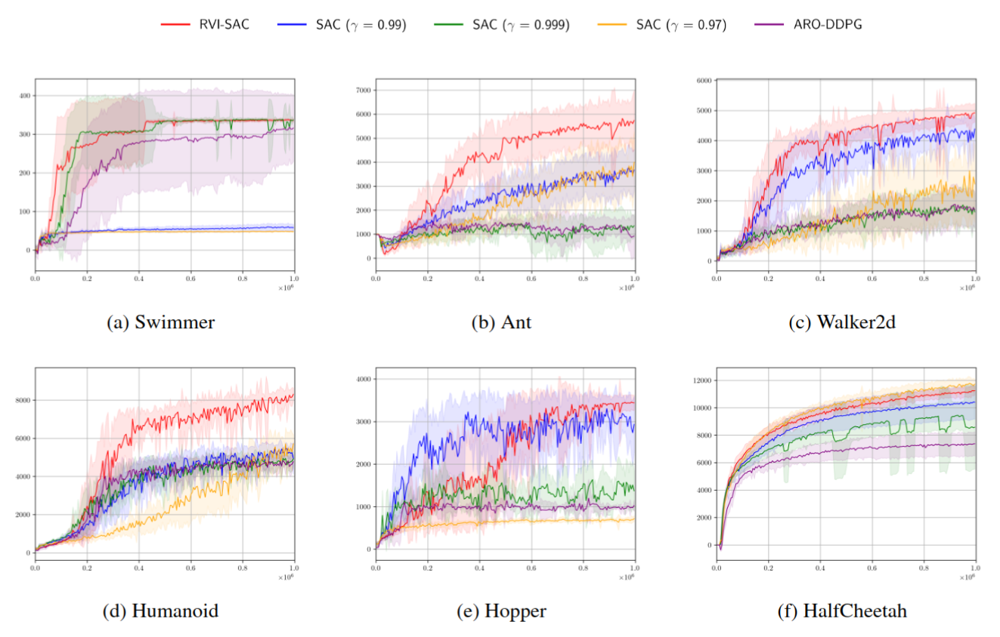

# Average Reward Deep RL
[](https://arxiv.org/abs/2408.01972)

This implementation serves as the reference code for the paper [*RVI-SAC: Average Reward Off-Policy Deep Reinforcement Learning*](https://arxiv.org/abs/2408.01972), authored by the same researchers. Unlike the commonly used discounted reward sum, RVI-SAC employs average reward as its objective, as shown below (precisely, the objective includes entropy; for more details, please refer to the paper).

$$ \rho^\pi := \lim_{T \rightarrow \infty} \frac{1}{T} E_\pi [\sum_{t=0}^T R_t] $$

Average reward is a more natural objective than the discounted reward sum for continuing tasks (e.g., locomotion tasks) where episodes continue indefinitely. By utilizing the average reward instead of the discounted reward, performance improvements can be expected. Our algorithm, RVI-SAC, is a novel method that combines average reward with Soft Actor-Critic.

This research has been accepted at ICML 2024.

## Installation

### Prerequisites

- Make sure you have `poetry` installed on your system. If you don't have it yet, you can install it by following the instructions [here](https://python-poetry.org/docs/#installation).

### Setting up the Environment

Run the following command to set up the environment using `poetry`.

```bash
poetry install
```

## Implemented Algorithms

- [x] (proposal) RVI-SAC
- [x] [Soft Actor-Critic](https://arxiv.org/abs/1801.01290) (Original Implementation: [here]())
- [x] [ARO-DDPG](https://arxiv.org/abs/2305.12239) (Original Implementation: [here](https://github.com/namansaxena9/ARO-DDPG))

## Run

Hyperparameters are managed by [hydra](https://hydra.cc/docs/intro/). See [config.yaml](experiments/conf/config.yaml) for details.

```bash
poetry run python3 experiments/main.py \
  algo=rvi_sac \
  env=Ant-v4 \
  seed=0
```

## Results of MuJoCo Experiments



## Related Links

- [arXiv](https://arxiv.org/abs/2408.01972)
- [ICML page](https://icml.cc/virtual/2024/poster/32727)
- [PMLR](https://proceedings.mlr.press/v235/hisaki24a.html)
